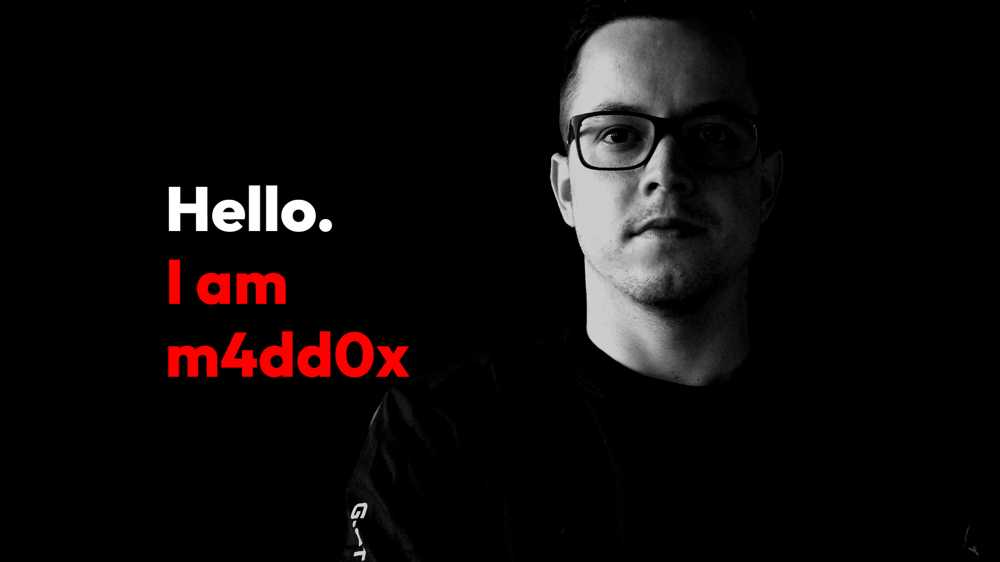

# Table of Contents

- [Overview](#overview)
- [Installation](#installation)
- [Technologies Used](#technologies-used)

## Overview

- A Personal Portfolio made with love.
- [https://m4dd0c.netlify.app/](https://m4dd0c.netlify.app/)

## Installation

1. Clone the repository
   `git clone https://github.com/m4dd0c/personal-portfolio.git`
2. Install Dependencies
   `npm i`
3. Start
   `npm run dev`

> [!tip]  
> If you're in `linux` or `mac`
> then you can use `setup.sh` to set it up locally.

## Technologies Used

- [NextJS](#NextJS)
- [Typescript](#Typescript)
- [Framer Motion](#framer-motion)
- [Tailwindcss](#tailwindcss)
